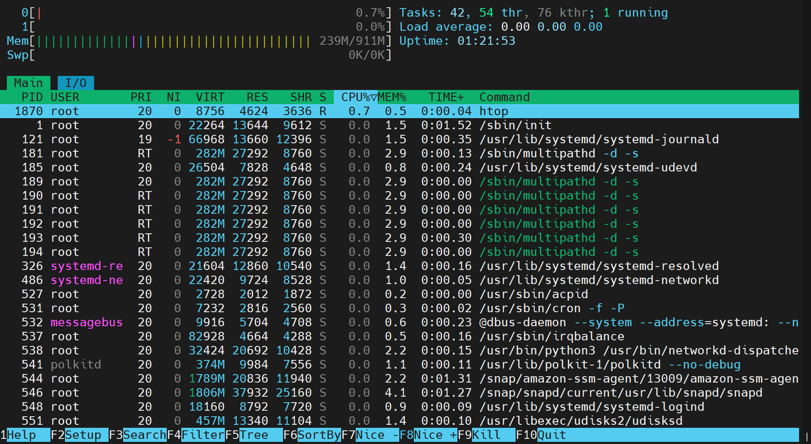

## Task
Today's goal is to **understand where things live in Linux** and **practice troubleshooting like a DevOps engineer**.

You will create notes covering:
- Linux File System Hierarchy (the most important directories)
- Practice solving real-world scenarios step by step

This consolidates your Linux fundamentals and prepares you for real-world troubleshooting.

### Part 1: Linux File System Hierarchy (30 minutes)

Document the purpose of these **essential** directories:

**Core Directories (Must Know):**
- `/` (root) - The starting point of everything
    - I can see this is root directory of linux/ubuntu 
    - I can see number of directories which helps to run or maintain ubutu linux system or OS.

- `/home` - User home directories 
    - I can see 2 user directory or user's home directories.
    - I would use this directory when perticulr user needs to perform any action or i can see his/her users saved files or directories only if i'm root.

- `/root` - Root user's home directory
    - This is the topmost level of the entire Linux file system hierarchy. You use it when you need to access system-wide files or understand how your storage is structured.
    - This is the private home folder specifically for the "root" user (the system administrator). It is distinct from the / directory. 

- `/etc` - Configuration files
    - The '/etc' directory holds various configuration files that are essential for the proper functioning of the system and its installed applications.

- `/var/log` - Log files (very important for DevOps!)
    - I would use the /var/log directory in Linux primarily for troubleshooting, security auditing, and monitoring system health. 
    - As the centralized repository for log files, it captures events from the operating system, background daemons, and installed applications

- `/tmp` - Temporary files
    - In Ubuntu, temporary files are primarily stored in the /tmp directory. 
    - These files serve various purposes, such as caching data and storing temporary session information.
    - The beauty of the /tmp directory is that it is automatically cleaned on every system reboot, ensuring that you start with a clean slate each time.

**Additional Directories (Good to Know):**
- `/bin` - Essential command binaries
    - Bin directories in Linux are dedicated areas for storing executable files, commonly known as binaries. 
    - These binaries are required for the execution of different commands and programs on a Linux system. 
    - The binary folders ensure that these executables are easily accessible to users.

- `/usr/bin` - User command binaries
    - Purpose: /usr/bin is the main directory for binaries managed by the system's package manager (e.g., apt on Ubuntu, dnf on Fedora). 
    - System-Wide Access: Programs installed here are accessible to all users and are part of the operating system's core components or software officially provided by the distribution.
    - Accessing Installed Software: You "use" this directory every time you run standard commands or applications like python, git, vim, or curl.

- `/opt` - Optional/third-party applications
    - /opt : It keeps third party applications separate from system installed packages. 
    - It prevents files from interfering with /usr/bin , /usr/lib , or other system directories. It makes uninstalling easier.


**Hands-on task:**
```bash
# Find the largest log file in /var/log
du -sh /var/log/* 2>/dev/null | sort -h | tail -5
    - root@ip-172-31-11-112:~# du -sh /var/log/* 2>/dev/null | sort -h | tail -5
        204K    /var/log/auth.log
        348K    /var/log/cloud-init.log
        416K    /var/log/sysstat
        756K    /var/log/syslog
        38M     /var/log/journal

# Look at a config file in /etc
cat /etc/hostname
    -root@ip-172-31-11-112:~# cat /etc/hostname
        ip-172-31-11-112


# Check your home directory
ls -la ~
```
    -root@ip-172-31-11-112:~# ls -la
        total 128
        drwx------  6 root root  4096 Apr 10 20:12 .
        drwxr-xr-x 22 root root  4096 Apr 10 19:23 ..
        -rw-------  1 root root  2742 Apr  7 23:35 .bash_history
        -rw-r--r--  1 root root  3106 Apr 22  2024 .bashrc
        drwx------  4 root root  4096 Apr  5 21:46 .config
        -rw-------  1 root root    20 Apr 10 20:12 .lesshst
        -rw-------  1 root root    23 Apr  7 23:24 .lvm_history
        -rw-r--r--  1 root root   161 Apr 22  2024 .profile
        drwx------  2 root root  4096 Apr  6 22:30 .ssh
        -rw-------  1 root root  1263 Apr 10 19:37 .viminfo
        drwxr-xr-x  2 root root  4096 Apr  6 22:31 Nitin
        -rw-r--r--  1 root root 79250 Apr  6 20:05 index.html
        drwx------  3 root root  4096 Apr  5 21:43 snap
    -
---

### Part 2: Scenario-Based Practice (40 minutes)

**Important:** Focus on understanding the **troubleshooting flow**, not memorizing commands. Use the hints!

---

#### SOLVED EXAMPLE: Understanding How to Approach Scenarios

**Example Scenario: Check if a service is running**
```
Question: How do you check if the 'nginx' service is running?
```

**My Solution (Step by step):**

**Step 1:** Check service status
```bash
systemctl status nginx
```
**Why this command?** It shows if the service is active, failed, or stopped

**Step 2:** If service is not found, list all services
```bash
systemctl list-units --type=service
```
**Why this command?** To see what services exist on the system

**Step 3:** Check if service is enabled on boot
```bash
systemctl is-enabled nginx
```
**Why this command?** To know if it will start automatically after reboot

**What I learned:** Always check status first, then investigate based on what you see.

---

Now try these scenarios yourself:

---

**Scenario 1: Service Not Starting** 
```
A web application service called 'myapp' failed to start after a server reboot.
What commands would you run to diagnose the issue?
Write at least 4 commands in order.
```

**Hint:**
- First check: Is the service running or failed?
- Then check: What do the logs say?
- Finally check: Is it enabled to start on boot?

**Commands to explore:** `systemctl status myapp`, `systemctl is-enabled myapp`, `journalctl -u myapp -n 50`

**Resource:** Review Day 04 (Process and Services practice)

**Template for your answer:**
```
Step 1: [command]
Why: [one line explanation]

Step 2: [command]
Why: [one line explanation]

...
```

---

**Scenario 2: High CPU Usage** 
```
Your manager reports that the application server is slow.
You SSH into the server. What commands would you run to identify
which process is using high CPU?
```

**Hint:**
- Use a command that shows **live** CPU usage
- Look for processes sorted by CPU percentage
- Note the PID (Process ID) of the top process

**Commands to explore:** `top` (press 'q' to quit), `htop`, `ps aux --sort=-%cpu | head -10`

Step 1: [htop]
Why: [it will show live resource optimization via active dashboard which can show CPU mem and its details]


Step 2: [ps aux --sort=-%cpu | head -10]
Why: [It shows the top 10 processes consuming the highest CPU at that moment.]
    - root@ip-172-31-11-112:~# ps -aux --sort=-%cpu | head -10
        USER         PID %CPU %MEM    VSZ   RSS TTY      STAT START   TIME COMMAND
        root         601  0.1  5.0 1802036 47108 ?       Ssl  19:23   0:05 /usr/bin/containerd
        ubuntu      1295  0.0  0.8  15544  8268 ?        S    19:23   0:04 sshd: ubuntu@pts/0
        root         546  0.0  4.0 1850020 37928 ?       Ssl  19:23   0:01 /snap/snapd/current/usr/lib/snapd/snapd
        root         544  0.0  2.2 1832756 20732 ?       Ssl  19:23   0:01 /snap/amazon-ssm-agent/13009/amazon-ssm-agen

**Resource:** Review Day 05 (Troubleshooting Drill - CPU & Memory section)

---

**Scenario 3: Finding Service Logs** 
```
A developer asks: "Where are the logs for the 'docker' service?"
The service is managed by systemd.
What commands would you use?
```

**Hint:**
- systemd services → logs are in journald
- Command pattern: `journalctl -u <service-name>`
- Use -n flag to limit number of lines
- Use -f flag to follow logs in real-time (like tail -f)

Step 1: [journalctl -u docekr>]
Why: [It will print log entries from systemd journal (docker - it is service)]

Step 2: [journalctl -u docekr -f]
Why: [It will show docker log on active terminal for live record/realtime]


**Commands to explore:**
```bash
# Check service status first
systemctl status ssh

# View last 50 lines of logs
journalctl -u ssh -n 50

# Follow logs in real-time
journalctl -u ssh -f
```

**Resource:** Review Day 04 (Process and Services - Log checks section)

---

**Scenario 4: File Permissions Issue** 
```
A script at /home/user/backup.sh is not executing.
When you run it: ./backup.sh
You get: "Permission denied"

What commands would you use to fix this?
```

**Hint:**
- First: Check what permissions the file has
- Understand: Files need 'x' (execute) permission to run
- Fix: Add execute permission with chmod

**Step-by-step solution structure:**
```
Step 1: Check current permissions
Command: ls -l /home/user/backup.sh
Look for: -rw-r--r-- (notice no 'x' = not executable)

Step 2: Add execute permission
Command: chmod +x /home/user/backup.sh

Step 3: Verify it worked
Command: ls -l /home/user/backup.sh
Look for: -rwxr-xr-x (notice 'x' = executable)

Step 4: Try running it
Command: ./backup.sh
```

**Resource:** Review Day 02 (File Permissions and Users Management)

---

## Why This Matters for DevOps
Understanding the file system is critical for:
- Knowing where to find logs, configs, and binaries
- Troubleshooting deployment issues
- Writing automation scripts that work across systems

Scenario-based practice prepares you for:
- Real production incidents
- DevOps interviews
- On-call troubleshooting under pressure

These are questions you **will** face in interviews and during real incidents.

---

## Submission
1. Fork this `90DaysOfDevOps` repository
2. Navigate to the `2026/day-07/` folder
3. Add your `day-07-linux-fs-and-scenarios.md` file
4. Commit and push your changes to your fork

---

## Learn in Public
Share your Day 07 progress on LinkedIn:

- Post 2–3 lines on what you learned about Linux file system
- Share one scenario you found challenging and how you solved it
- Optional: screenshot of your notes

Use hashtags:
```
#90DaysOfDevOps
#DevOpsKaJosh
#TrainWithShubham
```

Happy Learning
**TrainWithShubham**
