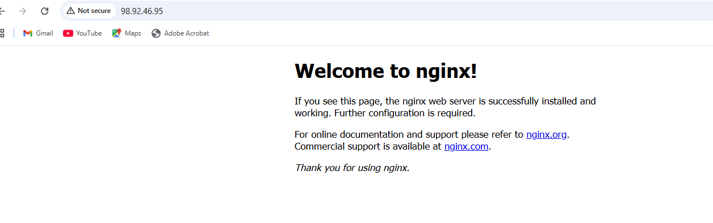

# Day 08 – Cloud Server Setup: Docker, Nginx & Web Deployment

## Task
Today's goal is to **deploy a real web server on the cloud** and learn practical server management.

You will:
- Launch a cloud instance (AWS EC2 or Utho)
- Connect via SSH
- Install Nginx
- Configure security groups for web access (port 80 by default for nginx)
- Extract and save logs to a file
- Verify your webpage is accessible from the internet

This is real DevOps work - exactly what you'll do in production.

---

## Expected Output
By the end of today, you should have:

1. A markdown file named: `day-08-cloud-deployment.md`
2. Screenshots showing:
   - SSH connection to your server
   - Nginx welcome page accessible from browser
   - Log file contents
3. The log file: `nginx-logs.txt`

---

## Prerequisites
- AWS account (Free Tier) OR Utho account
- Basic understanding of Linux commands (Days 1-7)
- SSH client (Terminal on Mac/Linux, PuTTY on Windows)

---

## Guidelines

### Part 1: Launch Cloud Instance & SSH Access (15 minutes)

**Step 1: Create a Cloud Instance**


**Step 2: Connect via SSH**


---

### Part 2: Install Docker & Nginx (20 minutes)

**Step 1: Update System**


**Step 3: Install Nginx**

**Verify Nginx is running:**

---

### Part 3: Security Group Configuration (10 minutes)

**Test Web Access:**
Open browser and visit: `http://98.92.46.95`

You should see the **Nginx welcome page**!

📸 **Screenshot this page** - you'll need it for submission

---

### Part 4: Extract Nginx Logs (15 minutes)

**Step 1: View Nginx Logs**


**Step 2: Save Logs to File**

**Step 3: Download Log File to Your Local Machine**
```bash
# On your local machine (new terminal window)
# For AWS:
scp -i your-key.pem ubuntu@<your-instance-ip>:~/nginx-logs.txt .

# For Utho:
scp root@<your-instance-ip>:~/nginx-logs.txt .
```

---


## Documentation Template

Create your `day-08-cloud-deployment.md` with this structure:

## Commands Used
[apt update -y]
    - To download updates for new packages
[apt upgrade -y]
    - To install new packages/ to patch ubuntu system
[apt install nginx -y]
    - to install nginx web serer application

[ssytemctl status nginx]
    -  Loaded: loaded (/usr/lib/systemd/system/nginx.service; enabled; preset: enabled)
        Active: active (running) since Fri 2026-04-10 21:52:21 UTC; 4min 49s ago
        Docs: man:nginx(8)
        Process: 12830 ExecStartPre=/usr/sbin/nginx -t -q -g daemon on; master_process on; (code=exited, status=0/SUCCESS)
        Process: 12832 ExecStart=/usr/sbin/nginx -g daemon on; master_process on; (code=exited, status=0/SUCCESS)
        Main PID: 12861 (nginx)
        Tasks: 3 (limit: 1004)
        Memory: 2.4M (peak: 5.3M)
        CPU: 29ms
     CGroup: /system.slice/nginx.service
             ├─12861 "nginx: master process /usr/sbin/nginx -g daemon on; master_process on;"
             ├─12864 "nginx: worker process"
             └─12865 "nginx: worker process"

## Challenges Faced
[Describe any issues and how you solved them]

## What I Learned
[3-5 bullet points of key learnings]
    - I have leaned to inttall nginx webserver
    - i have leaned connect other instances using ssh commnad
    - now i can able to check status of application 
    - now i'm able to find and copy logs for nginx application

---


## Why This Matters for DevOps

This exercise teaches you:
- **Cloud infrastructure provisioning** - launching and configuring servers
- **Remote server management** - SSH, security, access control
- **Service deployment** - installing and running applications
- **Log management** - accessing and analyzing logs
- **Security** - configuring firewalls and security groups

These are core skills for any DevOps engineer working in production.

---


## Submission
1. Fork this `90DaysOfDevOps` repository
2. Navigate to the `2026/day-08/` folder
3. Add your `day-08-cloud-deployment.md` file
4. Add your `nginx-logs.txt` file
5. Add screenshots (name them: `ssh-connection.png`, `nginx-webpage.png`, `docker-nginx.png`)
6. Commit and push your changes to your fork

---

## Learn in Public
Share your Day 08 progress on LinkedIn:

- Post 2-3 lines on deploying your first cloud server
- Share screenshot of your Nginx webpage
- Mention one challenge you faced and solved
- Optional: Share your instance IP (if comfortable)

Use hashtags:
```
#90DaysOfDevOps
#DevOpsKaJosh
#TrainWithShubham
```

Happy Learning
**TrainWithShubham**
