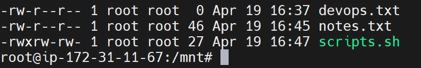

### Task 1: Create Files (10 minutes)

1. Create empty file `devops.txt` using `touch`
2. Create `notes.txt` with some content using `cat` or `echo`
3. Create `script.sh` using `vim` with content: `echo "Hello DevOps"`

**Verify:** `ls -l` to see permissions
## > Task 1 Completed - 

### Task 2: Read Files (10 minutes)

1. Read `notes.txt` using `cat`
    - root@ip-172-31-11-67:/mnt# cat notes.txt
        #This file is created for Linux Practice

        echo "Hello Devops"

2. View `script.sh` in vim read-only mode
    - root@ip-172-31-11-67:/mnt# ls -la
        total 16
        drwxr-xr-x  2 root root 4096 Apr 19 16:47 .
        drwxr-xr-x 22 root root 4096 Apr 19 16:35 ..
        -rw-r--r--  1 root root    0 Apr 19 16:37 devops.txt
        -rw-r--r--  1 root root   46 Apr 19 16:45 notes.txt
        -r--r--r--  1 root root   27 Apr 19 16:47 scripts.sh

3. Display first 5 lines of `/etc/passwd` using `head`
    - root@ip-172-31-11-67:/mnt# head -n5 /etc/passwd
        root:x:0:0:root:/root:/bin/bash
        daemon:x:1:1:daemon:/usr/sbin:/usr/sbin/nologin
        bin:x:2:2:bin:/bin:/usr/sbin/nologin
        sys:x:3:3:sys:/dev:/usr/sbin/nologin
        sync:x:4:65534:sync:/bin:/bin/sync

4. Display last 5 lines of `/etc/passwd` using `tail`
    - root@ip-172-31-11-67:/mnt# tail -n5 /etc/passwd
        fwupd-refresh:x:990:990:Firmware update daemon:/var/lib/fwupd:/usr/sbin/nologin
        polkitd:x:989:989:User for polkitd:/:/usr/sbin/nologin
        ec2-instance-connect:x:109:65534::/nonexistent:/usr/sbin/nologin
        _chrony:x:110:112:Chrony daemon,,,:/var/lib/chrony:/usr/sbin/nologin
        ubuntu:x:1000:1000:Ubuntu:/home/ubuntu:/bin/bash

### Task 3: Understand Permissions (10 minutes)

Format: `rwxrwxrwx` (owner-group-others)
- `r` = read (4), `w` = write (2), `x` = execute (1)

Check your files: `ls -l devops.txt notes.txt script.sh`

-rw-r--r--  1 root root    0 Apr 19 16:37 devops.txt 
    - #owner - can read & write 
    - #group - can read only 
    - #others - can read only 
-rw-r--r--  1 root root   62 Apr 19 17:31 notes.txt
    - #owner - can read & write 
    - #group - can read only 
    - #others - can read only 
-rwxrw-r--  1 root root   27 Apr 19 16:47 scripts.sh
    - #owner - can read, write & Excute
    - #group - can read only & write
    - #others - can read only 

### Task 4: Modify Permissions (20 minutes)

1. Make `script.sh` executable → run it with `./script.sh`
2. Set `devops.txt` to read-only (remove write for all)
3. Set `notes.txt` to `640` (owner: rw, group: r, others: none)
4. Create directory `project/` with permissions `755`

 - -r--r--r--  1 root root    0 Apr 19 16:37 devops.txt
    -rw-r-----  1 root root   62 Apr 19 17:31 notes.txt
    drwxr-xr-x  2 root root 4096 Apr 19 18:29 project
    -rwxrw-r--  1 root root   27 Apr 19 16:47 scripts.sh

### Task 5: Test Permissions (10 minutes)

1. Try writing to a read-only file - what happens?
    - INSERT -- W10: Warning: Changing a readonly file
    - E45: 'readonly' option is set (add ! to override) 
    - I'm able to save file with :wq!
2. Try executing a file without execute permission
    - bash: ./demo.sh: Permission denied
3. Document the error messages
